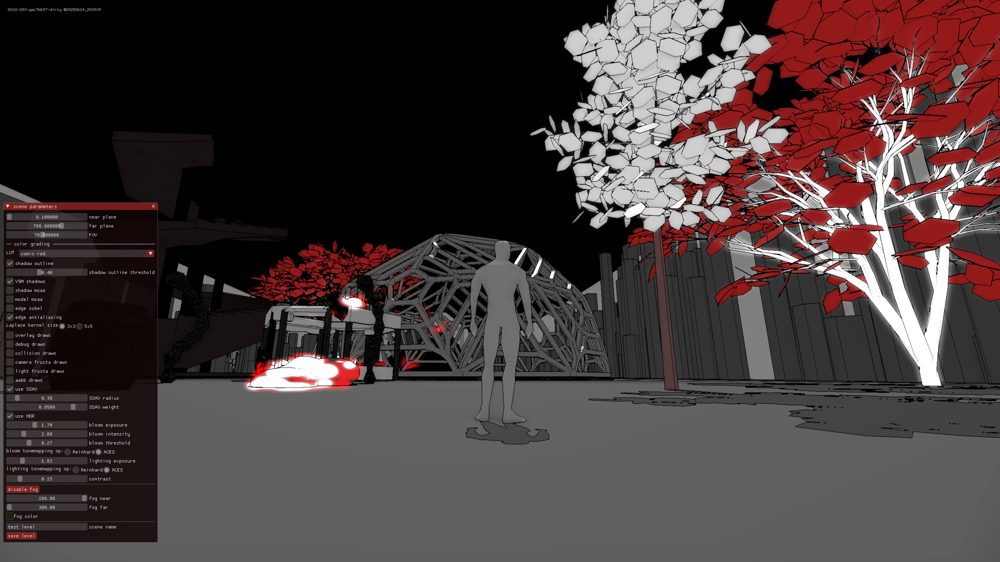

# CLAP game engine




# Index

- [Live demos and executables](#live-demos-and-executables)
  - [Built from the "main" branch](#built-from-the-main-branch)
  - [Built from the "testing" branch](#built-from-the-testing-branch)
- [Native demo executables](#native-demo-executables)
- [Source code and submodules](#source-code-and-submodules)
- [Local build (Macos)](#local-build-macos)
  - [Install dependencies](#install-dependencies)
  - [Build](#build)
  - [Run](#run)
- [Linux build](#linux-build)
- [Wasm build](#wasm-build)
  - [Emscripten](#emscripten)
  - [Create build_config file](#create-build_config-file)
  - [Run local web server](#run-local-web-server)
- [Windows build](#windows-build)
- [Build using cmake presets](#build-using-cmake-presets)
- [Build errors](https://github.com/virtuoso/clap/tree/main/docs/build-errors.md)
- [What to do with all this](#what-to-do-with-all-this)

## Live demos and executables
There are 2 live demos that build from this repository: a testbed of sorts -- a place for wild experiments and [Towards the Light](https://ldjam.com/events/ludum-dare/57/towards-the-light), a game made for Ludum Dare 57 game jam.

### Built from the "main" branch

| platform | testbed release build | testbed test build | ldjam57 release build | ldjam57 test build |
| -------- | --------------------- | ------------------ | --------------------- | ------------------ |
| web      | [clap](http://ash.works/clap/main/clap/) | [claptest](http://ash.works/clap/main/claptest/) | [ldjam57](http://ash.works/clap/main/ldjam57/) | [ldjam57 test](http://ash.works/clap/main/ldjam57test/) |
| linux x86_64 | [clap](http://ash.works/clap/main/linux/rel/bin/ldjam56) | [claptest](http://ash.works/clap/main/linux/test/bin/ldjam56) | [ldjam57](http://ash.works/clap/main/linux/rel/bin/ldjam57) | [ldjam57test](http://ash.works/clap/main/linux/test/bin/ldjam57) |
| Mac OS X arm64 | [clap](http://ash.works/clap/main/macos/rel/bin/ldjam56) | [claptest](http://ash.works/clap/main/macos/test/bin/ldjam56) | [ldjam57](http://ash.works/clap/main/macos/rel/bin/ldjam57) | [ldjam57test](http://ash.works/clap/main/macos/test/bin/ldjam57) |
| Windows x64 | [clap](http://ash.works/clap/main/w32rel/bin/ldjam56.exe) | [claptest](http://ash.works/clap/main/w32test/bin/ldjam56.exe) | [ldjam57](http://ash.works/clap/main/w32rel/bin/ldjam57.exe) | [ldjam57test](http://ash.works/clap/main/w32test/bin/ldjam57.exe) |

The windows executables are cross-built on linux using MinGW. There are also native windows builds: [clap](http://ash.works/clap/main/windows/debug/bin/ldjam56.exe), [ldjam57](http://ash.works/clap/main/windows/bin/debug/ldjam57.exe)

### Built from the "testing" branch

These are more for development-curious.

| platform | testbed release build | testbed test build | ldjam57 release build | ldjam57 test build |
| -------- | --------------------- | ------------------ | --------------------- | ------------------ |
| web      | [clap](http://ash.works/clap/testing/clap/) | [claptest](http://ash.works/clap/testing/claptest/) | [ldjam57](http://ash.works/clap/testing/ldjam57/) | [ldjam57 test](http://ash.works/clap/testing/ldjam57test/) |
| linux x86_64 | [clap](http://ash.works/clap/testing/linux/rel/bin/ldjam56) | [claptest](http://ash.works/clap/testing/linux/test/bin/ldjam56) | [ldjam57](http://ash.works/clap/testing/linux/rel/bin/ldjam57) | [ldjam57test](http://ash.works/clap/testing/linux/test/bin/ldjam57) |
| Mac OS X arm64 | [clap](http://ash.works/clap/testing/macos/rel/bin/ldjam56) | [claptest](http://ash.works/clap/testing/macos/test/bin/ldjam56) | [ldjam57](http://ash.works/clap/testing/macos/rel/bin/ldjam57) | [ldjam57test](http://ash.works/clap/testing/macos/test/bin/ldjam57) |
| Windows x64 | [clap](http://ash.works/clap/testing/w32rel/bin/ldjam56.exe) | [claptest](http://ash.works/clap/testing/w32test/bin/ldjam56.exe) | [ldjam57](http://ash.works/clap/testing/w32rel/bin/ldjam57.exe) | [ldjam57test](http://ash.works/clap/testing/w32test/bin/ldjam57.exe) |

## Source code and submodules

Checkout repository and modules

```sh
git submodule update --init --recursive
```

## Local build (Macos)

### Install dependencies

```sh
brew install cmake glew zlib libpng libogg libvorbis freetype glfw shaderc spirv-cross pkg-config
```

### Build

```sh
./configure.sh
./build.sh
```

### Run

Optionally, you can run a server that collects logs from all instances of the engine client for debugging purposes. If you don't specify "server_ip" in the build_config configuration file, or don't specify -DCLAP_BUILD_NETWORKING during cmake configuration stage, you don't have to run the server. Otherwise, set "server_ip" to the IP address of the machine where the server will be running.

```sh
build/debug/tools/server/server
```

And run the demo

```sh
build/test/demo/ldjam56/ldjam56
```

## Linux build

Install dependencies (see also the simple-build.yml in case this goes out of date):
```sh
sudo apt-get install -y libfreetype-dev libglew-dev libglfw3-dev libogg-dev libopenal-dev libpng-dev libvorbis-dev zlib1g-dev glslc spirv-cross
```

The rest is the same as the [Mac OS build instructions](#local-build-macos)

## Wasm build

Install some of the dependencies needed for native build: cmake, shaderc/glslc, spirv-cross.
See [Mac OS build](#local-build-macos) or [Linux build](#linux-build), depending on your host
operating system for details. The rest of the dependencies will be brought in by emsdk.

### Emscripten

Download and install [Emscripten](https://emscripten.org/docs/getting_started/downloads.html)

### Create build_config file

```sh
emsdk_env_path=<path to installed emscripten SDK>
www_dir=<path to www build folder where static content will be build>
```
See [Run](#run) section about the server_ip=... setting.

For example:

```sh
emsdk_env_path=${HOME}/src/game/emsdk/emsdk_env.sh
www_dir=${HOME}/src/game/www
```

### Run local web server

For example, using python3 embedded httpd server:

```sh
python3 -m http.server -d ${HOME}/src/game/www
```

## Windows build

Ok, are you sure? Yes? Read on.
For reference, check [windows-build github action](https://github.com/virtuoso/clap/blob/main/.github/workflows/windows-build.yml).

First, install [Visual Studio 2019](https://visualstudio.microsoft.com/vs/older-downloads/) Community edition (free). VS 2022 doesn't work yet, because of conflicts with windows-libc, somebody will fix it eventually.

Then, install [LLVM](https://releases.llvm.org/download.html) for clang. There's also a way of installing clang via Visual Studio, but this one is easier.

Then, install [python](https://www.python.org/downloads/windows/).

Then, set up vcpkg and set an environment variable to the path of the cloned repository:
```sh
git clone https://github.com/microsoft/vcpkg.git
cd vcpkg
.\bootstrap-vcpkg.bat -disableMetrics
export VCPKG_INSTALLATION_ROOT=.../vcpkg
```

Note: everything up to this point is preinstalled in github runners, so windows-build.yml doesn't mention any of that.

Then, install all the dependencies using vcpkg:
```sh
$VCPKG_INSTALLATION_ROOT/vcpkg.exe libpng:x64-windows-static glfw3:x64-windows-static glew:x64-windows-static freetype:x64-windows-static openal-soft:x64-windows-static libogg:x64-windows-static libvorbis:x64-windows-static shaderc spirv-cross
```

Then, in the root of the clap directory, configure and build using cmake. Use --parallel X option with cmake --build commands to speed things up.
```sh
cmake --preset w32test -B build/test
cmake --preset w32debug -B build/debug
cmake --build build/test
cmake --build build/debug
```

Then, run the result:
```sh
.\build\test\demo\ldjam56\ldjam56.exe
```

## Build using cmake presets

[Windows build](#windows-build) is an example of how to build using cmake presets (w32test, w32debug). These two require VCPKG_INSTALLATION_ROOT environment variable to point to vcpkg
root.

Wasm build can be done similarly, setting EMSDK to point to the Emscripten installation root.
Having done that, you can do one or several of the cmake presets:
```sh
cmake --preset emtest -B build/emtest
cmake --build build/emtest
```

## What to do with all this

Check out the brand new [CONTRIBUTING](https://github.com/virtuoso/clap/blob/main/CONTRIBUTING.md) file for details on the whats and the hows.
If you're using Visual Studio Code, [here](https://github.com/virtuoso/clap/blob/main/docs/vscode-setup.md) is a copy-pastable configuration for the project to get you up and running.
